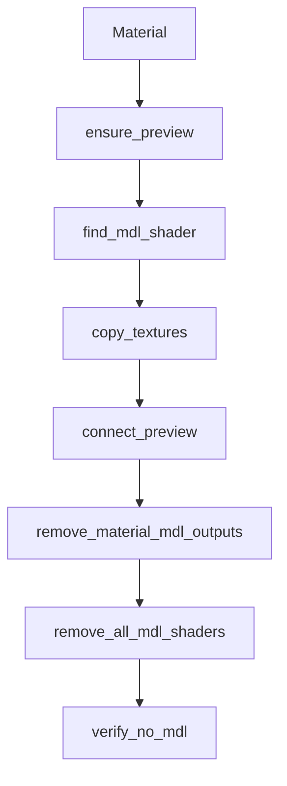

# convert_asset/no_mdl/materials.py 深入讲解

本文档对 `convert_asset/no_mdl/materials.py` 进行系统性讲解，帮助理解“在不打平的前提下移除 MDL，并构建 UsdPreviewSurface 网络”的实现要点与边界。

## 模块职责
- 仅处理“当前 root layer 拥有”的 `UsdShade.Material`；
- 为每个 Material 构建可用的 PreviewSurface 网络骨架；
- 从 MDL shader 的 pin 与 .mdl 源文本中解析贴图路径并连接；
- 合理设置颜色空间、UV、wrap、以及 Gloss→Roughness 的反转；
- 在无法获取贴图时用常量兜底；
- 移除 MDL Shader 与所有 MDL 相关的 Material 输出；
- 最终验证场景中不再包含 MDL。

## 关键约定
- 预览网络被创建在 `/{GROUP}` 的 `Scope` 下：
  - `PreviewSurface`（UsdPreviewSurface）
  - `Primvar_{UVSET}`（UsdPrimvarReader_float2, varname=UVSET）
  - `Tex_BaseColor / Tex_Roughness / Tex_Metallic / Tex_Normal`（UsdUVTexture）
- BaseColor 的“常量 vs 贴图”：
  - `ALWAYS_BAKE_TINT=True` → 总是写常量色；
  - 否则若 `BAKE_TINT_WHEN_WHITE=True` 且 BaseColor 贴图被判定为“白图”，写常量色；
  - 其它情况下优先连接贴图 `rgb`。

## 函数速览（契约）
- `ensure_preview(stage, mat) -> UsdShade.Shader`
  - 输入：Stage、Material
  - 输出：该材质下的 PreviewSurface 节点（已搭好骨架）
  - 失败模式：无，若节点已存在则复用

- `find_mdl_shader(mat) -> UsdShade.Shader|None`
  - 从 `outputs:surface:mdl` 或子 Shader 查找 MDL Shader

- `read_mdl_basecolor_const(mdl_shader) -> (bool, tuple)`
  - 从若干候选输入中读取 BaseColor 常量；失败返回 False 与白色

- `copy_textures(stage, mdl_shader, mat) -> (filled, has_c, c_rgb, bc_tex)`
  - 先读 MDL pin，再必要时解析 .mdl 文本；
  - `filled`：记录四通道贴图是否设置
  - `has_c/c_rgb`：是否有 BaseColor 常量与其值
  - `bc_tex`：BaseColor 贴图绝对路径（用于白图判断）

- `connect_preview(stage, mat, filled, has_c, c_rgb, bc_tex)`
  - 根据上一步结果，把贴图或常量连接到 PreviewSurface

- `remove_material_mdl_outputs(stage)`
  - 移除所有 Material 上的 MDL 输出与连接

- `remove_all_mdl_shaders(stage)`
  - 删除所有 MDL Shader prim（深→浅）

- `verify_no_mdl(stage) -> bool`
  - 全面检查场景是否仍含 MDL 残留

## 数据流（Mermaid）

## 边界与兼容
- `pxr` 导入依赖运行环境（如 Isaac Sim 或本地 USD SDK）；在纯静态分析环境中可能报缺失，这是正常的。
- `.mdl` 文本解析是尽力而为的兜底手段，无法保证覆盖所有供应商写法；
- `白图` 判断基于文件名启发式，命名不规范时可能失准；
- Gloss→Roughness 反转仅在检测到 `Roughness_fromGloss` 时启用；
- 对于不在当前 root layer 定义的材质，本模块不负责修改（由上层过滤控制）。

## 常见问答
- Q：为什么贴图的 `sourceColorSpace` 有的设 `sRGB` 有的设 `raw`？
  - A：BaseColor 是颜色贴图，使用 sRGB；Roughness/Metallic/Normal 是数据贴图，使用 raw。
- Q：没设 `defaultPrim` 会怎样？
  - A：与材质无直接关系，但影响单文件打开的显示入口与别人引用你文件的默认锚点。
- Q：为什么要把 Preview 节点放到一个 Scope 下？
  - A：避免与原节点命名冲突，且方便后续清理或识别转换产物。

## 参考
- USD Preview Surface 文档
- MDL 到 PBR 金属/粗糙度工作流的常见转换习惯
