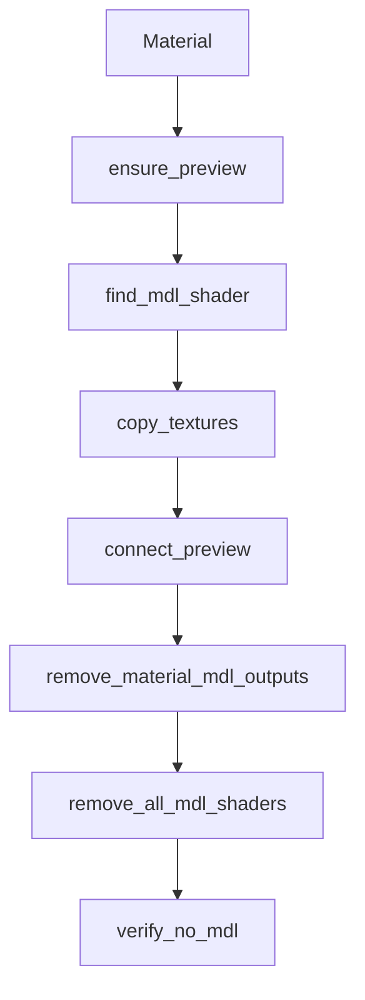

# convert_asset/no_mdl/materials.py 深入讲解

本文档对 `convert_asset/no_mdl/materials.py` 进行系统性讲解，帮助理解“在不打平的前提下移除 MDL，并构建 UsdPreviewSurface 网络”的实现要点与边界。

## 模块职责
- 仅处理“当前 root layer 拥有”的 `UsdShade.Material`；
- 为每个 Material 构建可用的 PreviewSurface 网络骨架；
- 从 MDL shader 的 pin 与 .mdl 源文本中解析贴图路径并连接；
- 合理设置颜色空间、UV、wrap、以及 Gloss→Roughness 的反转；
- 在无法获取贴图时用常量兜底；
- 移除 MDL Shader 与所有 MDL 相关的 Material 输出；
- 最终验证场景中不再包含 MDL。

## 关键约定
- 预览网络被创建在 `/{GROUP}` 的 `Scope` 下（每个 `Material` 自己的私有空间，避免和原有节点冲突）：
  - `PreviewSurface`（UsdPreviewSurface）：PBR 着色器，提供 `diffuseColor/roughness/metallic/normal` 等输入。
  - `Primvar_{UVSET}`（UsdPrimvarReader_float2）：读取几何体上的 UV 坐标集，`varname=UVSET` 指定 UV 集名字（比如 `st`）。
  - `Tex_BaseColor / Tex_Roughness / Tex_Metallic / Tex_Normal`（UsdUVTexture）：纹理采样器，负责把 2D 贴图根据 UV 坐标投射到模型表面。

更直观地理解：
- “UV 是坐标系”：3D 网格的每个顶点除了空间坐标（XYZ），还会存一组或多组二维坐标（UV）。这组坐标把 3D 表面“展平”到 2D 图片上。
- “纹理就是图片”：BaseColor/粗糙度/金属度/法线等信息都可以存在图片里；`UsdUVTexture` 用 UV 坐标在图片上采样对应的像素值。
- “PrimvarReader 是桥梁”：`UsdPrimvarReader_float2` 读取几何上的某个 UV 集（如 `st`），把它作为 `UsdUVTexture.st` 的输入。
- “PreviewSurface 是总线”：把各个 `UsdUVTexture` 的输出连到 `PreviewSurface` 对应参数，完成 PBR 着色。

数据流（简化）：
```
几何体(携带UV) --(varname=UVSET)--> PrimvarReader.result --(st)--> UsdUVTexture.file+st --(rgb/r)--> PreviewSurface.inputs
```

为什么要放在 `/{GROUP}` 的 `Scope` 下？
- 统一命名、集中管理：转换产物（Preview、PrimvarReader、Tex_*）全部收纳在一个子路径里，便于后续识别和清理；
- 避免冲突：不覆盖原有节点命名，也不影响外部引用的材质结构；
- 可控扩展：需要更多贴图（如 `AmbientOcclusion`、`Emissive`）时，可以在同一 Scope 下扩展。
- BaseColor 的“常量 vs 贴图”：
  - `ALWAYS_BAKE_TINT=True` → 总是写常量色；
  - 否则若 `BAKE_TINT_WHEN_WHITE=True` 且 BaseColor 贴图被判定为“白图”，写常量色；
  - 其它情况下优先连接贴图 `rgb`。

## 函数速览（契约）
- `ensure_preview(stage, mat) -> UsdShade.Shader`
  - 输入：Stage、Material
  - 输出：该材质下的 PreviewSurface 节点（已搭好骨架）
  - 失败模式：无，若节点已存在则复用

- `find_mdl_shader(mat) -> UsdShade.Shader|None`
  - 从 `outputs:surface:mdl` 或子 Shader 查找 MDL Shader

- `read_mdl_basecolor_const(mdl_shader) -> (bool, tuple)`
  - 从若干候选输入中读取 BaseColor 常量；失败返回 False 与白色

- `copy_textures(stage, mdl_shader, mat) -> (filled, has_c, c_rgb, bc_tex)`
  - 先读 MDL pin，再必要时解析 .mdl 文本；
  - `filled`：记录四通道贴图是否设置
  - `has_c/c_rgb`：是否有 BaseColor 常量与其值
  - `bc_tex`：BaseColor 贴图绝对路径（用于白图判断）

- `connect_preview(stage, mat, filled, has_c, c_rgb, bc_tex)`
  - 根据上一步结果，把贴图或常量连接到 PreviewSurface

- `remove_material_mdl_outputs(stage)`
  - 移除所有 Material 上的 MDL 输出与连接

- `remove_all_mdl_shaders(stage)`
  - 删除所有 MDL Shader prim（深→浅）

- `verify_no_mdl(stage) -> bool`
  - 全面检查场景是否仍含 MDL 残留

## 数据流（Mermaid）


## 边界与兼容
- `pxr` 导入依赖运行环境（如 Isaac Sim 或本地 USD SDK）；在纯静态分析环境中可能报缺失，这是正常的。
- `.mdl` 文本解析是尽力而为的兜底手段，无法保证覆盖所有供应商写法；
- `白图` 判断基于文件名启发式，命名不规范时可能失准；
- Gloss→Roughness 反转仅在检测到 `Roughness_fromGloss` 时启用；
- 对于不在当前 root layer 定义的材质，本模块不负责修改（由上层过滤控制）。

## 常见问答
- Q：为什么贴图的 `sourceColorSpace` 有的设 `sRGB` 有的设 `raw`？
  - A：BaseColor 是颜色贴图，使用 sRGB；Roughness/Metallic/Normal 是数据贴图，使用 raw。
- Q：没设 `defaultPrim` 会怎样？
  - A：与材质无直接关系，但影响单文件打开的显示入口与别人引用你文件的默认锚点。
- Q：为什么要把 Preview 节点放到一个 Scope 下？
  - A：避免与原节点命名冲突，且方便后续清理或识别转换产物。

## 参考
- USD Preview Surface 文档
- MDL 到 PBR 金属/粗糙度工作流的常见转换习惯

---

## 补充知识（入门到进阶）

1) UVSet（多 UV 集）
- 一个模型可以有多套 UV（例如 `st`、`uv2`）。不同用途可能使用不同的 UV 集，比如光照贴图用 `uv2`。
- 本项目通过配置 `UVSET` 指定使用哪一套；`Primvar_{UVSET}` 的 `varname` 就是这个名字。

2) 颜色空间（Color Space）
- `BaseColor` 属于“颜色贴图”，应设置 `sourceColorSpace=sRGB`，这样采样时会进行正确的伽马处理。
- `Roughness/Metallic/Normal` 属于“数据贴图”，使用线性空间（`raw`），避免数字被错误伽马校正。

3) 法线贴图（Normal Map）
- 法线贴图通常存储在 RGB 三通道中，描述“表面法线的偏移”，用于营造细节起伏。
- 在 PreviewSurface 中，我们把 `Tex_Normal.rgb` 连接到 `normal` 输入；若没有法线贴图，这个输入可以留空。

4) wrap 与重复（wrapS / wrapT）
- `UsdUVTexture` 的 `wrapS/T` 决定“当 UV 超出 0~1 范围时如何采样”。常见模式：`repeat`、`clamp`、`mirror`。
- 我们默认 `repeat`，因为大多数 PBR 贴图都以平铺为常态；如有特殊需求可后续按材质自定义。

5) Gloss → Roughness 的反转
- 有些资产只提供“光泽度(Gloss)”贴图（与粗糙度相反）。
- 当检测到 `Roughness_fromGloss` 时，我们在 `Roughness` 纹理节点上写入 `scale=-1, bias=1`，实现 r 通道取反并平移到 [0,1]。

6) UDIM（若你的贴图是 1001、1002…）
- `UsdUVTexture` 支持 UDIM：在文件路径中使用 `<UDIM>` 占位符，如 `Tex/BaseColor.<UDIM>.png`，系统会根据 UV 自动选择切片。
- 本模块不强制处理 UDIM 细节，但不会阻碍你在资产里使用它。

7) 性能与内存建议
- 若 BaseColor 被判断为“白图”，且配置开启“白图时烘焙常量”，可以避免多余的纹理读取。
- 合理使用 sRGB/raw，避免错误的色彩处理导致重复导入或离线修正。
- 只为需要的通道建立纹理连接，缺失则写常量，减少不必要的节点与连接。
