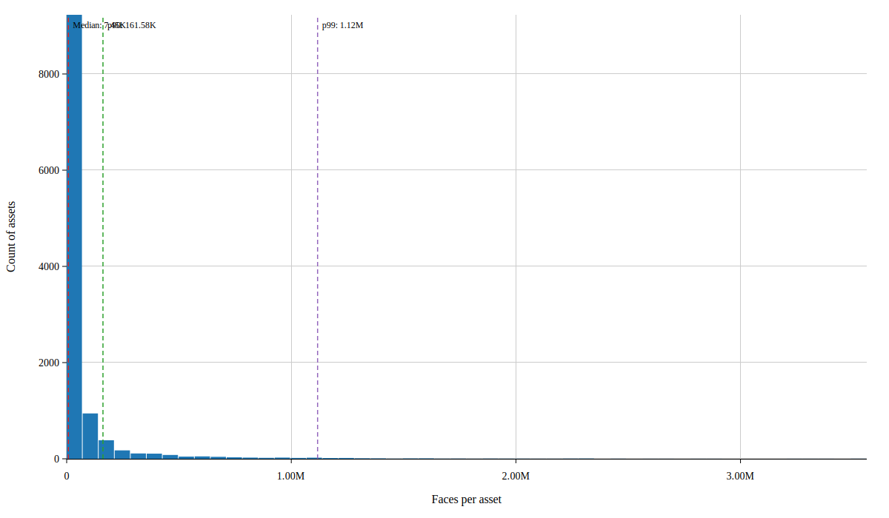
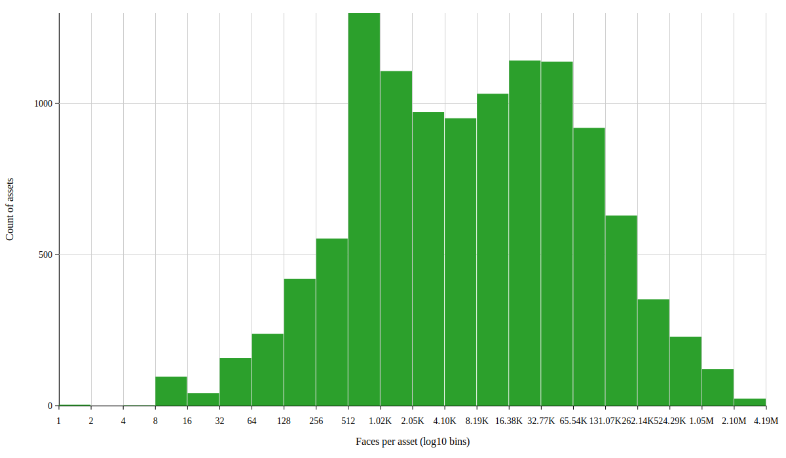
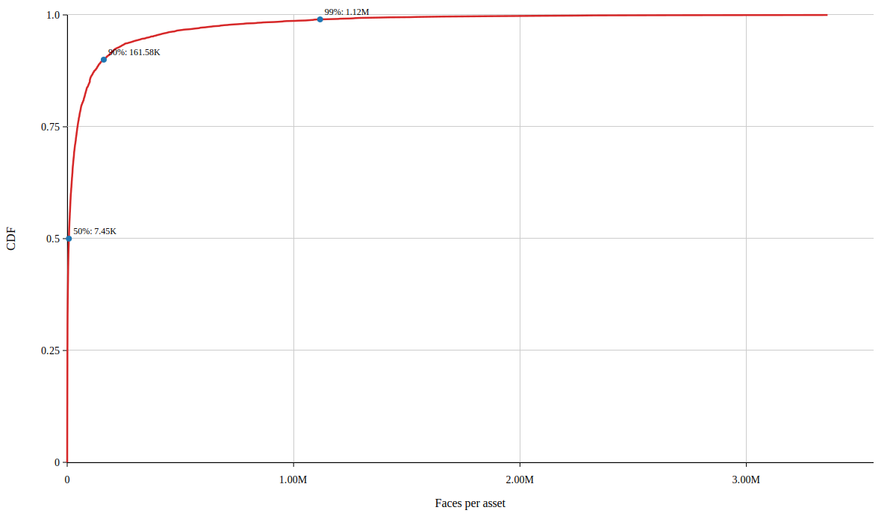
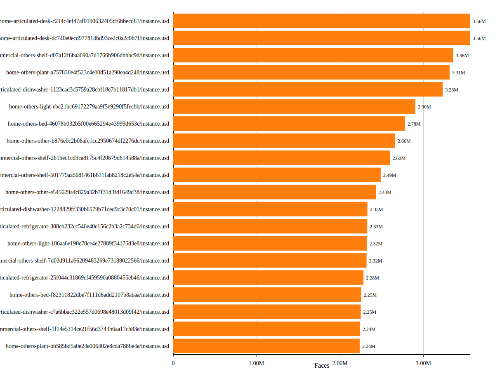
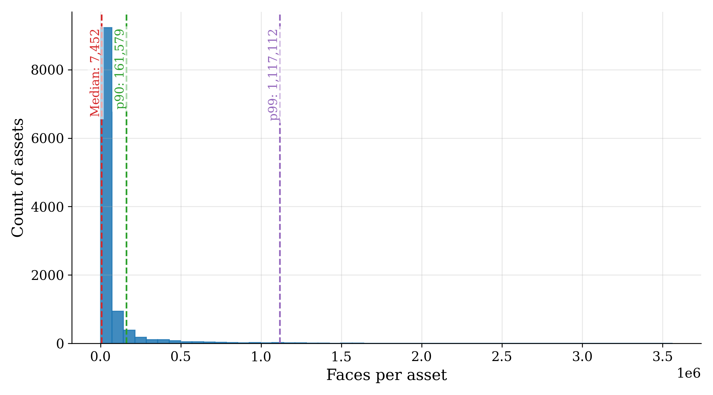
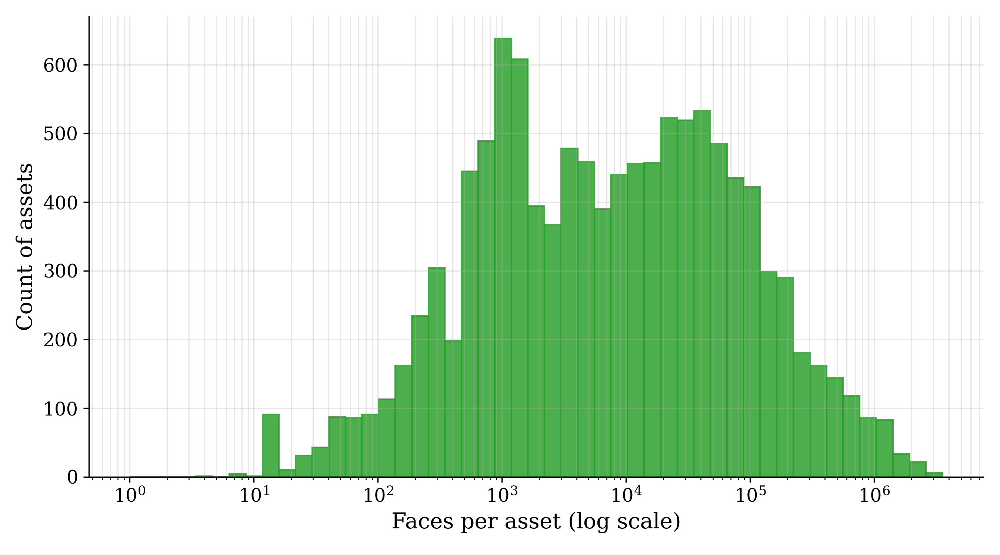
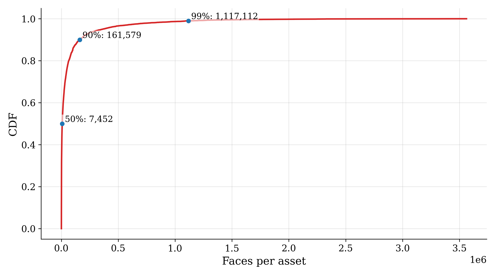
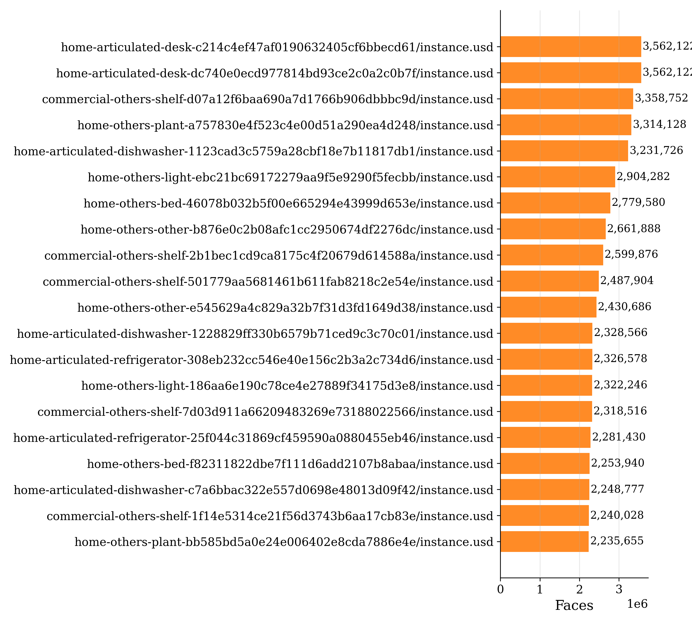

# Faces report

Generated: 2025-11-13 05:04:46

## Summary

- Files matched: 11423
- Total faces: 831191570
- Mean faces: 72764.74
- Min faces: 0 (in /shared/smartbot/zhuzihou/GRScenes-100/Asset_Library/commercial-articulated-person-d41d8cd98f00b204e9800998ecf8427e/instance.usd)
- Median (p50): 7452
- p90: 161579, p95: 362601, p99: 1117112
- Max faces: 3562122 (in /shared/smartbot/zhuzihou/GRScenes-100/Asset_Library/home-articulated-desk-c214c4ef47af0190632405cf6bbecd61/instance.usd)

## Charts

## Top 20 assets by faces

| Rank | Faces | Path |
|---:|---:|:---|
| 1 | 3562122 | /shared/smartbot/zhuzihou/GRScenes-100/Asset_Library/home-articulated-desk-c214c4ef47af0190632405cf6bbecd61/instance.usd |
| 2 | 3562122 | /shared/smartbot/zhuzihou/GRScenes-100/Asset_Library/home-articulated-desk-dc740e0ecd977814bd93ce2c0a2c0b7f/instance.usd |
| 3 | 3358752 | /shared/smartbot/zhuzihou/GRScenes-100/Asset_Library/commercial-others-shelf-d07a12f6baa690a7d1766b906dbbbc9d/instance.usd |
| 4 | 3314128 | /shared/smartbot/zhuzihou/GRScenes-100/Asset_Library/home-others-plant-a757830e4f523c4e00d51a290ea4d248/instance.usd |
| 5 | 3231726 | /shared/smartbot/zhuzihou/GRScenes-100/Asset_Library/home-articulated-dishwasher-1123cad3c5759a28cbf18e7b11817db1/instance.usd |
| 6 | 2904282 | /shared/smartbot/zhuzihou/GRScenes-100/Asset_Library/home-others-light-ebc21bc69172279aa9f5e9290f5fecbb/instance.usd |
| 7 | 2779580 | /shared/smartbot/zhuzihou/GRScenes-100/Asset_Library/home-others-bed-46078b032b5f00e665294e43999d653e/instance.usd |
| 8 | 2661888 | /shared/smartbot/zhuzihou/GRScenes-100/Asset_Library/home-others-other-b876e0c2b08afc1cc2950674df2276dc/instance.usd |
| 9 | 2599876 | /shared/smartbot/zhuzihou/GRScenes-100/Asset_Library/commercial-others-shelf-2b1bec1cd9ca8175c4f20679d614588a/instance.usd |
| 10 | 2487904 | /shared/smartbot/zhuzihou/GRScenes-100/Asset_Library/commercial-others-shelf-501779aa5681461b611fab8218c2e54e/instance.usd |
| 11 | 2430686 | /shared/smartbot/zhuzihou/GRScenes-100/Asset_Library/home-others-other-e545629a4c829a32b7f31d3fd1649d38/instance.usd |
| 12 | 2328566 | /shared/smartbot/zhuzihou/GRScenes-100/Asset_Library/home-articulated-dishwasher-1228829ff330b6579b71ced9c3c70c01/instance.usd |
| 13 | 2326578 | /shared/smartbot/zhuzihou/GRScenes-100/Asset_Library/home-articulated-refrigerator-308eb232cc546e40e156c2b3a2c734d6/instance.usd |
| 14 | 2322246 | /shared/smartbot/zhuzihou/GRScenes-100/Asset_Library/home-others-light-186aa6e190c78ce4e27889f34175d3e8/instance.usd |
| 15 | 2318516 | /shared/smartbot/zhuzihou/GRScenes-100/Asset_Library/commercial-others-shelf-7d03d911a66209483269e73188022566/instance.usd |
| 16 | 2281430 | /shared/smartbot/zhuzihou/GRScenes-100/Asset_Library/home-articulated-refrigerator-25f044c31869cf459590a0880455eb46/instance.usd |
| 17 | 2253940 | /shared/smartbot/zhuzihou/GRScenes-100/Asset_Library/home-others-bed-f82311822dbe7f111d6add2107b8abaa/instance.usd |
| 18 | 2248777 | /shared/smartbot/zhuzihou/GRScenes-100/Asset_Library/home-articulated-dishwasher-c7a6bbac322e557d0698e48013d09f42/instance.usd |
| 19 | 2240028 | /shared/smartbot/zhuzihou/GRScenes-100/Asset_Library/commercial-others-shelf-1f14e5314ce21f56d3743b6aa17cb83e/instance.usd |
| 20 | 2235655 | /shared/smartbot/zhuzihou/GRScenes-100/Asset_Library/home-others-plant-bb585bd5a0e24e006402e8cda7886e4e/instance.usd |

---
Report generated by scripts/plot_faces_report.py (SVG charts, no external deps).

## Matplotlib charts (PNG/PDF)

**Histogram (linear)**

**Histogram (log10 bins)**

**CDF**

**Top 20**

